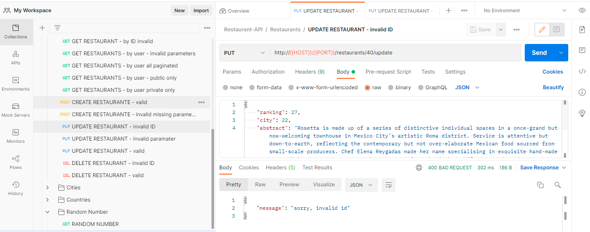
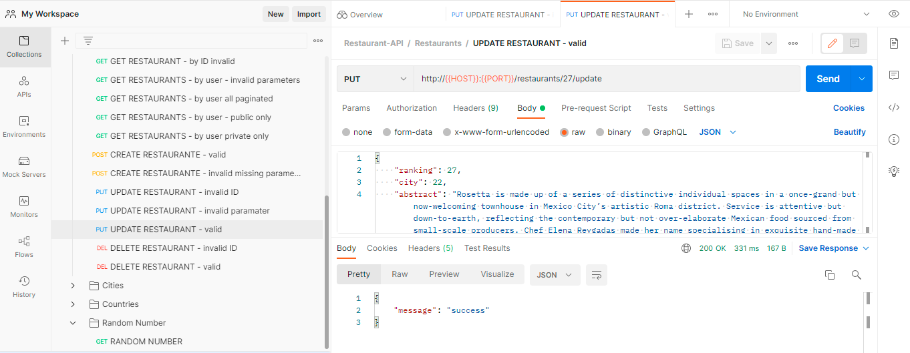

# Restaurants REST API

>   **This project is an HTTP server REST API implementation**

## Objectives: 
* Creating a registration service that receives an email and a password.
* Allowing login into the server with an email and a password.
* Allowing logged-in users to do CRUD operations into the table.
* Adding an endpoint that requires the server to retrieve a random number from a public API and send it back to the user.

## Table of Content
* [Architecture](#architecture)
  * [Technology Stack ](#technology-stack)
  * [Database Diagram Model](#database-diagram-model)
* [Environment](#environment)
  * [File Descriptions](#file-descriptions)
  * [API Endpoints](#api-endpoints)
* [Installation](#installation)
* [Usage](#usage)
  * [Testing with Postman](#postman)
  * [Testing with Swagger Page](#swagger-documentation-page)
  * [Testing in Console](#console)
* [Bugs](#bugs)
* [Author](#author)
* [License](#license)

## Architecture

### Technology Stack

    AWS: RDS, EC2, VPC
    bcrypt 3.2.2
    flasgger 0.9.5
    Flask 2.1.2
    Gunicorn 20.1.0
    MySQL Client 2.1.0
    MySQL Server 8.0
    pyJWT 1.4.2
    Python 3.8.10
    SQLALchemy 1.4.36
### Database Diagram Model

## Environment
This project was developed on Ubuntu 20.22 LTS using python 3.8.10 with flask framework, connecting to a MySQL Database.

### File Descriptions
The API documentation is available in the repository folder [documentation](documentation) in .yml files, also you can access it to [Swagger Documentation Page](http://54.174.10.3:8000/apidocs).

`app.py` - contains the entry point of the API.

`documentation/` contains files used for document endpoints of the API.  
`documentation/collections` directory contains files used for use the API.  
`documentation/images` contains images for README.

`models/` contains classes used for this project, defined as the [model](#database-diagram-model):

`routes/` contains endpoints implemented for the API:  
`routes/restaurant_blueprint.py`  implemented routes to CREATE, READ, UPDATE and DELETE restaurants.  
`routes/city_blueprint.py` implements endpoints to READ cities.  
`routes/country_blueprint.py` implements endpoints to READ countries.  
`routes/user_blueprint.py`  implements endpoints to CREATE and READ a user.  
`routes/random_blueprint.py` implements endpoints to READ a random number from a public API.         

`security/` contains functions used to encrypt and decrypt tokens to identify users for this project:

`validators/` contains methods used to validate request parameters.

### API Endpoints
This is the list of available endpoints for this project.

**Authorization**

|Method	    |Path       |Description                        |
|-------    |-------    |-------                            |
|POST	    |/auth/	    |Return the token access and valid for 20 minutes.  Must send the email and password of the user in the request body.    |

**Cities**

|Method	    |Path	                |Description                        |
|-------    |-------                |-------                            |
|GET	    | /cities/      	    |Return all cities in the database.  Pagination:  `page` indicates the page number you want to see.  `limit` indicates the items per page. * By default, if not query params, the program returns one page with five items. * If the page does not exist, return pagination info and an empty dictionary.  e.g. `/cities?page=2&limit=2`   |
|GET	    | /cities/{city_id}	    |Return a city specified in the request.  e.g.  `/cities/15`             |

**Countries**

|Method	    |Path	                |Description                        |
|-------    |-------                |-------                            |
|GET        |/countries/            |Return all countries in the database. Pagination:  `page` indicates the page number you want to see.  `limit` indicates the items per page. * By default, if not query params, the program returns one page with five items. * If the page does not exist, return pagination info and an empty dictionary.  e.g. `/countries?page=1&limit=10`   |
|GET        |/countries/{country_id}|Return a city specified in the request. e.g.  `/countries/5`        |

**Random**

|Method	    |Path	                |Description                        |
|-------    |-------                |-------                            |
|GET	    |/random/	            |Return random numbers              |

**Restaurants**

|Method	    |Path	                                |Description                                    |
|-------    |-------                                |-------                                        |
|GET        |/restaurants/                          |Return all public restaurants in the database.  Pagination:  `page` indicates the page number you want to see.  `limit` indicates the items per page. * By default, if not query params, the program returns one page with five items. * If the page does not exist, return pagination info and an empty dictionary.  e.g. `/restaurants?page=8&limit=2`  |
|POST	    |/restaurants/create	                |Add a new restaurant to the database.  The new restaurant info must be present in the body request. The fields abstract, chef, city, name, public_access and ranking are mandatory. e.g.   request body: `{ "abstract": "Perfect flavour for a summer night", "chef": "Luciano Rivarola", "city": 13, "name": "Nola", "public_access": true, "ranking": 35}"`          |
|GET	    |/restaurants/user	                    |Return login user records in the database.  Pagination:  * By default, if not query params, the program returns one page with five items. `page` indicates the page number you want to see.  `limit` indicates the items per page.  Access:  * By default, if not query params, the program returns all user-created restaurants. `private` when true, return only private user-created restaurants `public` when true, return only public user-created restaurants  If the page does not exist, return pagination info and an empty dictionary.  e.g.   `/restaurants/user?private=true&page=1&limit=2`  `/restaurants/user`     |
|GET	    |/restaurants/{restaurant_id}	        |Return an specific restaurant. e.g.  `/restaurants/20`                  |
|DELETE	    |/restaurants/{restaurant_id}/delete	|Delete a restaurant in the database. `/restaurants/20/delete`            |
|PUT	    |/restaurants/{restaurant_id}/update	|Modify an existing restaurant in the database.   The restaurant info must be present in the body request and the user must be the restaurant creator to modify it.  The fields available are abstract, chef, city, name, public_access and ranking. The program doesn't support other restaurant fields. e.g.   request body: `{ "chef": "Alexa Namur", "public_access": false}"`  |
 

**Users**

|Method	    |Path       |Description                            |
|-------    |-------    |-------                                |
|GET	    |/users/	|Return user info stored in the database. Users can only get their own information|
|POST	    |/users/	|Add a new user to the database.  The new user info must be present in the body request. The fields username, email and password are mandatory. The password must contain at least 10 characters, one lowercase letter, one uppercase letter and one of the following characters: !, @, #, ? or ] e.g.   request body: `{ "email": "example@example.com", "password":"examPle]01", "username":"example"}`       |

## Installation
1. Clone this repository

       $   git clone "https://github.com/anversa-pro/restaurants-rest-api"
2. Access the 'restaurants-rest-api' directory:

       $   cd restaurants-rest-api
3. As a good practice, I suggest you create a virtual environment, e.g.

       $   python3 -m venv myvenv
4. Activate the new environment

       $   source myevn/bin/activate
5. Install the requirements

       $   pip install -r requirements.txt
6. Run the program

       $   python3 app.py
    Now you are running the API and available to create requests locally and test functionality, e.g. 

          * Running on all addresses (0.0.0.0)
            WARNING: This is a development server. Do not use it in a production deployment.
          * Running on http://192.172.0.0:8000 (Press CTRL+C to quit)
          * Restarting with stat
          * Debugger is active!
          * Debugger PIN: 940-225-637
7. To test the API, copy the IP address from your console, e.g. `192.172.0.0` and go to [Usage](#usage) 
8. When you have done, terminate the app process with `Ctrl+c` and deactivate the venv.

     $   deactivate

## Usage

--- IMPORTANT: The project has access to an AWS RDS with prefilled data by default. Further, a Gunicorn server over AWS EC2 is available to test the API. Access to these tools is temporary. When no longer available, you can find a script in the repo to build it locally or with your preferred provider and update the .env file with the new database credentials. ---

Note: If the server is no longer available, or you are testing the project locally, change the HOST for the IP you get running the app during the [installation](#installation) process.   

Three ways to test the API:

### Postman

Load the postman collection in the [collections](documentation/collections) folder into your postman account to test each endpoint.  

#### Examples of use
The section shows an UPDATE request.
1. Go to the `User` folder and select `LOGIN` and then `Send`. The server will return an access token you'll need to try the endpoints.
2. Go to the `Restaurants` folder and select  `UPDATE RESTAURANT - invalid ID` and then `Send`. The response shows an error 400 BAD REQUEST, the ID selected for UPDATE is invalid. 

3. Go to the `Restaurants` folder and select  `UPDATE RESTAURANT - valid` and then `Send`. The response shows a successful operation.

### Swagger Documentation Page

Follow the default link [Swagger Documentation Page](http://54.174.10.3:8000/apidocs).    
If the connection is no longer available, type in your browser: ` http://<YOUR HOST>:8000/apidocs `  

#### Examples of use
This section shows the GET random number request. 
1. Display the GET Random option and select `Try it out`, 
2. This test does not need parameters. Select `Execute` 
3. Go to Responses, the section server response and into the Response 200 box, you'll see the body and headers returned from the server.
4. You can click on `Execute` again a see new numbers displayed.

### Console
You can use consoles like cmd, Powershell, Ubuntu or Git bash to use the cURL method.

        $ curl -X <METHOD> "<SCHEME>://<HOST>:<PORT>/<PATH>?<SEARCH>"  -H "KEY: VALUE" -d "{BODY REQUEST CONTENT}"

#### Examples of use
This example shows POST login and GET Restaurants requests.
1. Open the console and type the curl line to request the login:

        $ curl -X POST "http://54.174.10.3:8000/auth" -H "Content-Type: application/json" -d "{ \"email\":\"testerOne@testermail.com\", \"password\":\"ABcd#12345\"}"
    The response:

        {"access_token":"eyJ0e   ....  9Hjhbid5kJbo"}

2. Copy the access token. The token is valid for 20 minutes and must be attached to each request.
3. Type the following line to get the user-created private restaurants, then replace <access_token> with the one you get in the login request.

        $ curl -X GET "http://54.174.10.3:8000/restaurants/user?private=true" -H "Authorization: JWT <access_token>"

    The response is a dictionary with all private restaurants the user has created.

## Bugs
No known bugs at this time.

## Author
Angela Vergara | 
[LinkedIn](https://www.linkedin.com/in/angela-vergara-salamanca/?locale=en_US) | 
[Github](https://github.com/anversa-pro) |

## License
Public Domain. No copy write protection.
