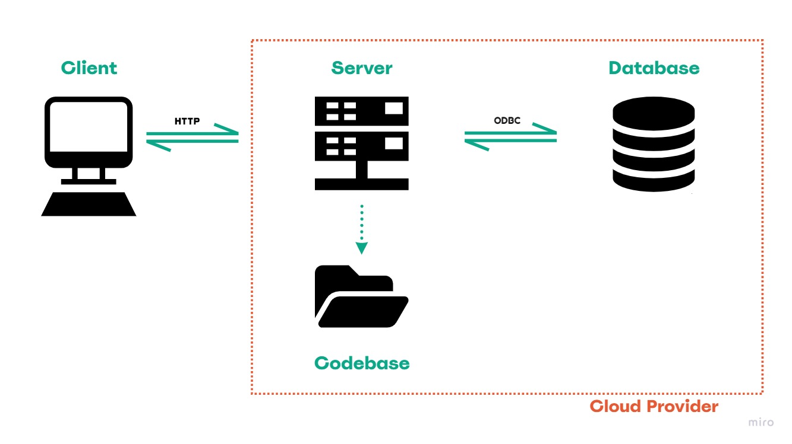
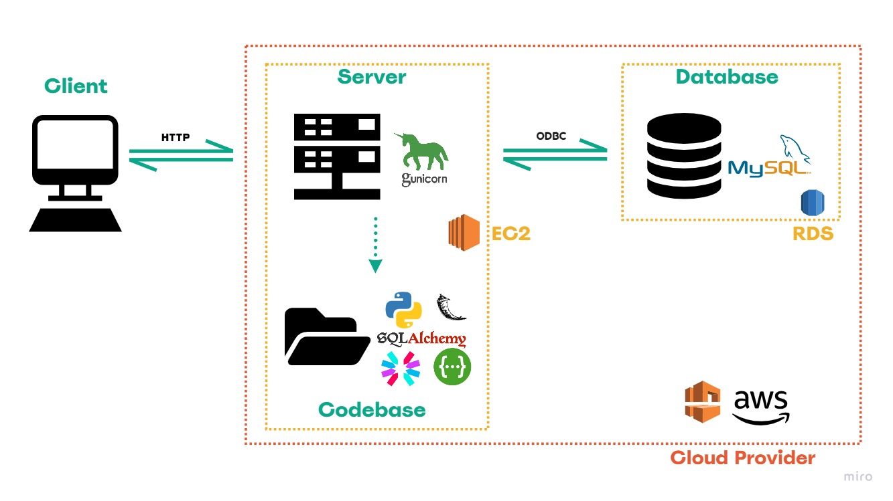
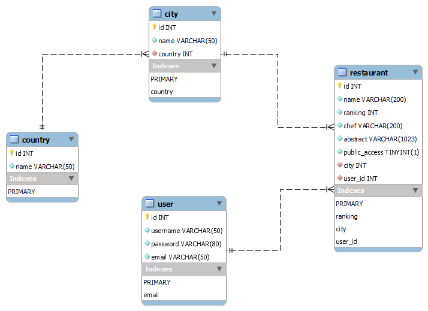
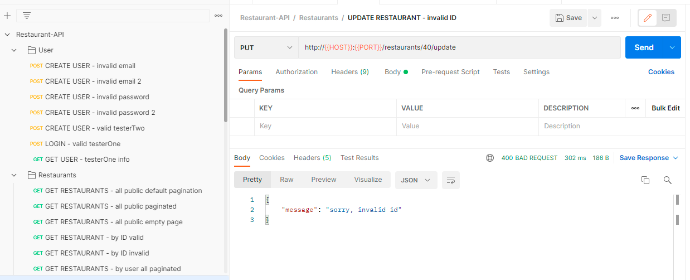
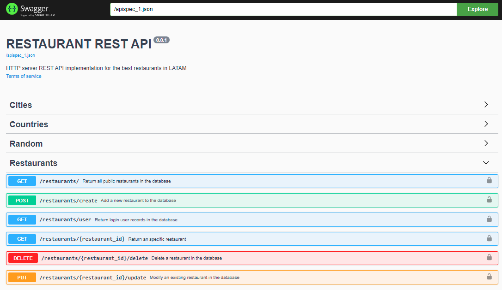

# Restaurants REST API

>   **This project is an HTTP server REST API implementation**

## Objectives: 
* Creating a registration service that receives an email and a password.
* Allowing login into the server with an email and a password.
* Allowing logged-in users to do CRUD operations into the table.
* Adding an endpoint that requires your server to retrieve a random number from a public API and send it back to the user.

## Table of Content
* [Architecture](#architecture)
  * [Technology Stack ](#technology-stack)
  * [Database Diagram Model](#database-diagram-model)
* [Environment](#environment)
  * [File Descriptions](#file-descriptions)
* [Installation](#installation)
* [Usage](#usage)
  * [Testing with Postman](#postman)
  * [Testing with Swagger Page](#swagger-documentation-page)
  * [Testing in Console](#console)
* [Bugs](#bugs)
* [Author](#author)
* [License](#license)

## Architecture

### Technology Stack

    AWS: RDS, EC2, VPC
    bcrypt 3.2.2
    flasgger 0.9.5
    Flask 2.1.2
    Gunicorn 20.1.0
    MySQL Client 2.1.0
    MySQL Server 8.0
    pyJWT 1.4.2
    Python 3.8.10
    SQLALchemy 1.4.36
### Database Diagram Model

## Environment
This project was developed on Ubuntu 20.22 LTS using python 3.8.10 with flask framework, connecting to a MySQL Database.

### File Descriptions
The API documentation is available in the repository folder [documentation](documentation) in .yml files, also you can access it to [Swagger Documentation Page](http://54.174.10.3:8000/apidocs).

`app.py` - contains the entry point of the API.

`documentation/` contains files used for document endpoints of the API.  
`documentation/collections` directory contains files used for use the API.  
`documentation/images` contains images for README.

`models/` contains classes used for this project, defined as the [model](#database-diagram-model):

`routes/` contains endpoints implemented for the API:  
`routes/restaurant_blueprint.py`  implemented routes to CREATE, READ, UPDATE and DELETE restaurants.  
`routes/city_blueprint.py` implements endpoints to READ cities.  
`routes/country_blueprint.py` implements endpoints to READ countries.  
`routes/user_blueprint.py`  implements endpoints to CREATE and READ a user.  
`routes/random_blueprint.py` implements endpoints to READ a random number from a public API.         

`security/` contains functions used to encrypt and decrypt tokens to identify users for this project:

`validators/` contains methods used to validate request parameters.
 
## Installation
1. Clone this repository

       $   git clone "https://github.com/anversa-pro/restaurants-rest-api"
2. Access the 'restaurants-rest-api' directory:

       $   cd restaurants-rest-api
3. As a good practice, I suggest you create a virtual environment, e.g.

       $   python3 -m venv myvenv
4. Activate the new environment

       $   source myevn/bin/activate
5. Install the requirements

       $   pip install -r requirements.txt
6. Run the program

       $   python3 app.py
    Now you are running the API and available to create requests locally and test functionality, e.g. 

          * Running on all addresses (0.0.0.0)
            WARNING: This is a development server. Do not use it in a production deployment.
          * Running on http://192.172.0.0:8000 (Press CTRL+C to quit)
          * Restarting with stat
          * Debugger is active!
          * Debugger PIN: 940-225-637
7. To test the API, copy the IP address from your console, e.g. `192.172.0.0` and go to [Usage](#usage) 
8. When you have done, terminate the app process with `Ctrl+c` and deactivate the venv.

     $   deactivate

## Usage

--- IMPORTANT: The project has access to an AWS RDS with prefilled data by default. Further, a Gunicorn server over AWS EC2 is available to test the API. Access to these tools is temporary. When no longer available, you can find a script in the repo to build it locally or with your preferred provider and update the .env file with the new database credentials. ---

Note: If the server is no longer available, or you are testing the project locally, change the HOST for the IP you get running the app during the [installation](#installation) process.   

Three ways to test the API:

### Postman
Load the postman collection in the [collections](documentation/collections) folder into your postman account to test each endpoint.

Note: If the connection is no longer available, change the HOST variable for a public server IP, or the IP you get after following the [installation](#installation/6) process.

### Swagger Documentation Page

Follow the default link [Swagger Documentation Page](http://54.174.10.3:8000/apidocs). If the connection is no longer available, type in your browser: ` http://<YOUR HOST>:8000/apidocs ` 

Type the parameters according to your preference and execute the request. A box will show you the response from the server.

### Console
Open a console to use the method CURL method.

        $ curl -X <METHOD> "<SCHEME>://<HOST>:<PORT>/<PATH>?<SEARCH>"
  in e.g.

        $ curl -X GET "http://54.174.10.3:8000/random/"
        $ curl -X POST "http://54.174.10.3:8000/auth" -H "Content-Type: application/json" -d "{ \"email\":\"testerOne@testermail.com\", \"password\":\"ABcd#12345\"}"
        $ curl -X GET "http://54.174.10.3:8000/restaurants/user?private=true" -H "Authorization: JWT <access-token>
        $ curl -X POST "http://54.174.10.3:8000/restaurants/create" -H "Authorization: JWT <access-token> -H "Content-Type: application/json" -d "{ \"abstract\": \"Perfect flavour for a summer night\", \"chef\": \"Luciano Rivarola\", \"city\": 13, \"name\": \"Nola\", \"public_access\": true, \"ranking\": 16}"
        $ curl -X DELETE "http://54.174.10.3:8000/restaurants/5/delete" -H "Authorization: JWT <access-token>"

## Bugs
No known bugs at this time.

### Author
Angela Vergara | 
[LinkedIn](https://www.linkedin.com/in/angela-vergara-salamanca/?locale=en_US) | 
[Github](https://github.com/anversa-pro) |

## License
Public Domain. No copy write protection.
